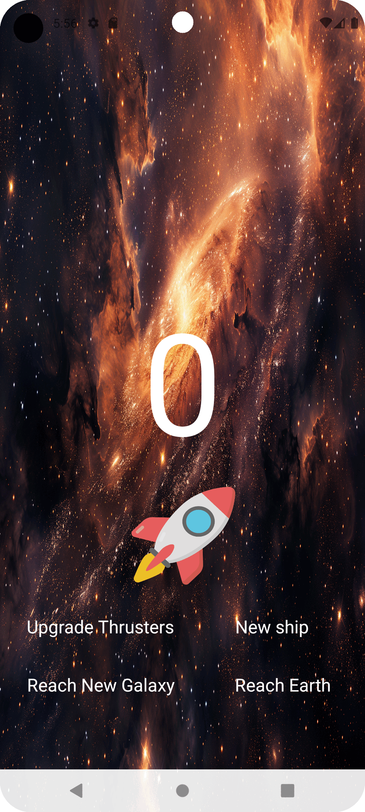

<<<<<<< HEAD
# Lab 1: Tap Counter App

Course Link: [CodePath Android Course](https://courses.codepath.org/courses/and102/unit/1#!labs)

Submitted by: Pooja Loganathan

Rocket Tap is an Android app inspired by idle tap games, allowing users to accumulate points through taps, which can be exchanged for upgrades.

Time spent: 5 hours spent in total

## Application Features

### Required Features

The following **required** functionality is completed:

- [ ] (2 pts) **User can see a number displayed on the screen. The number starts at 0.**
    -  <!-- Replace this link with your actual image/GIF link -->

- [ ] (2 pts) **User can tap on a button to see the number displayed increase by 1.**
    -   <!-- Replace this link with your actual image/GIF link -->

### Stretch Features

The following **stretch** functionality is implemented:

- [ ] (2 pts) **User can exchange the number of taps accumulated for upgrades:**
  - 20 taps for an upgrade that makes each tap count as 2 taps. (20 taps)
        - Use a Toast for positive (purchase) or negative (can't afford) notifications.
        -  <!-- Replace this link with your actual image/GIF link -->

- [ ] (2 pts) **User can exchange taps for a custom icon button.**
  - 20 taps for a custom icon button. (20 taps)
        - Use a Toast for positive (purchase) or negative (can't afford) notifications.
        -  <!-- Replace this link with your actual image/GIF link -->

- [ ] (2 pts) **User can customize the app's theme (Enter a new galaxy in exchange for 20 taps).**
    -  <!-- Replace this link with your actual image/GIF link -->

- [ ] (+2 bonus pts) **User has progressively difficult goals to reach in terms of the number of taps accumulated.**
    - Display each goal on the screen, and track the total number of goals reached.
    - Use a Toast to notify of a reached goal.
    -  <!-- Replace this link with your actual image/GIF link -->

## Notes

I had to do some research on how to change the apps background with the buttons and how to get rid of them once they were clicked. The most 
difficult part for me was figuring how to get the texts over buttons but I eventually came to a solution

## Resources
- GIF created with [CloudConvert](https://cloudconvert.com/)
- [ConstraintLayout documentation](https://developer.android.com/training/constraint-layout)
- [Displaying Toasts](https://guides.codepath.com/android/Displaying-Toasts)

## License

```plaintext
    Copyright [2024] [Pooja Loganathan]

    Licensed under the Apache License, Version 2.0 (the "License");
    you may not use this file except in compliance with the License.
    You may obtain a copy of the License at

        http://www.apache.org/licenses/LICENSE-2.0

    Unless required by applicable law or agreed to in writing, software
    distributed under the License is distributed on an "AS IS" BASIS,
    WITHOUT WARRANTIES OR CONDITIONS OF ANY KIND, either express or implied.
    See the License for the specific language governing permissions and
    limitations under the License.
=======
>>>>>>> main
